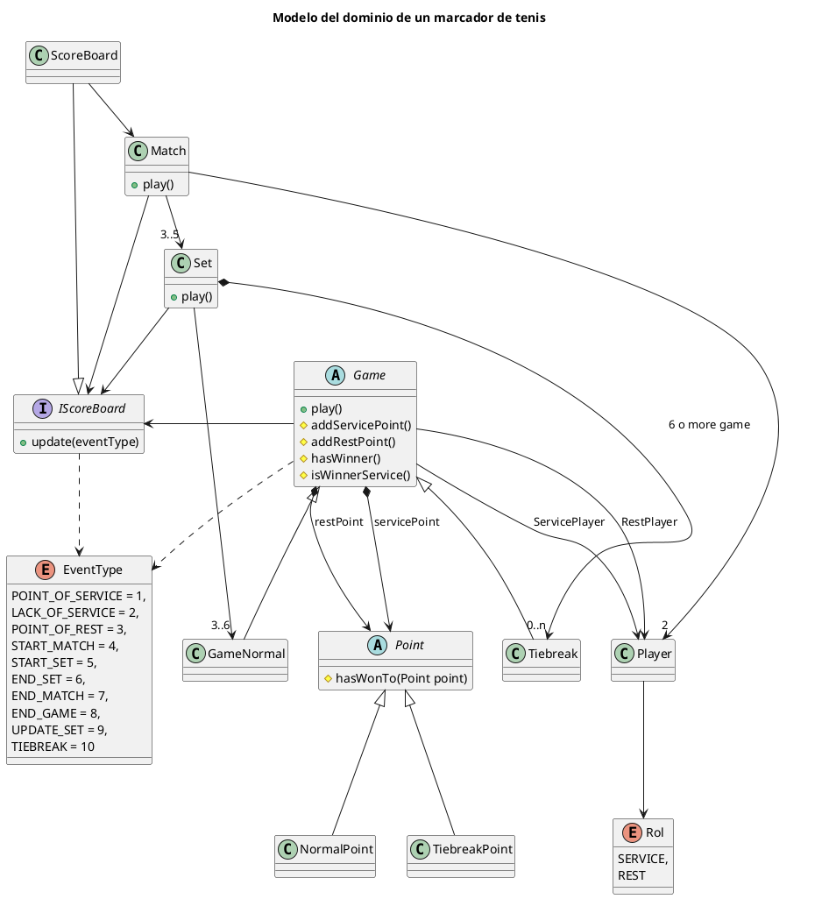

###Modelo del dominio

```plantuml
@startuml

title "Modelo del dominio de un marcador de tenis"

@startuml

title "Modelo del dominio de un marcador de tenis"

ScoreBoard --> Match

Match --> "3..5" Set
Match --> "2" Player
Player --> Rol

Set --> "3..6" GameNormal

Game <|-- Tiebreak
Game <|-- GameNormal


Game --> Player: ServicePlayer
Game --> Player: RestPlayer
Game ..> EventType
Game *--> Point : servicePoint
Game *--> Point : restPoint
Point <|-- NormalPoint
Point <|-- TiebreakPoint

IScoreBoard <|-up- ScoreBoard
IScoreBoard ..> EventType

Match -down-> IScoreBoard
Set -down-> IScoreBoard
Game -left-> IScoreBoard

Set *--> "0..n" Tiebreak:  6 o more game

class Match {
 +play()
}

class Set {
  +play()
}

abstract class Point {
}

enum EventType {
 POINT_OF_SERVICE = 1,
 LACK_OF_SERVICE = 2,
 POINT_OF_REST = 3,
 START_MATCH = 4,
 START_SET = 5,        
 END_SET = 6,
 END_MATCH = 7,
 END_GAME = 8,
 UPDATE_SET = 9,
 TIEBREAK = 10
}

abstract class Game {
  +play()
  #addServicePoint()
  #addRestPoint()
  #hasWinner()
  #isWinnerService()
}

abstract class Point {
  #hasWonTo(Point point)
}

interface IScoreBoard {
  +update(eventType)
}


enum Rol {
  SERVICE,
  REST
}

@enduml
```